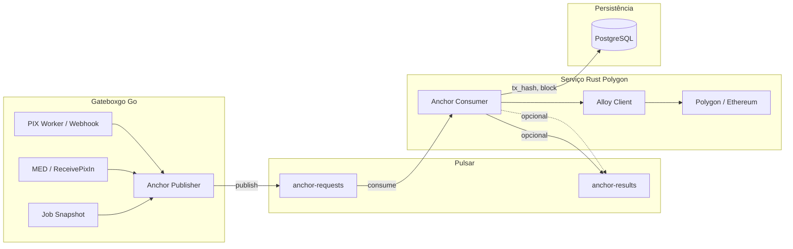
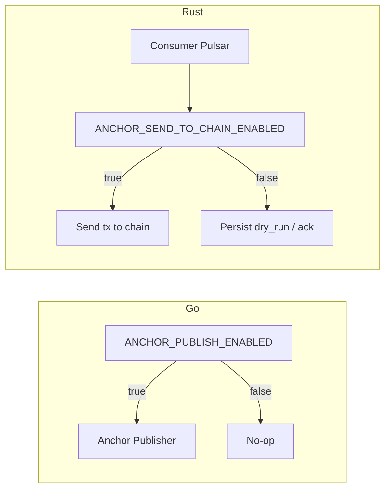
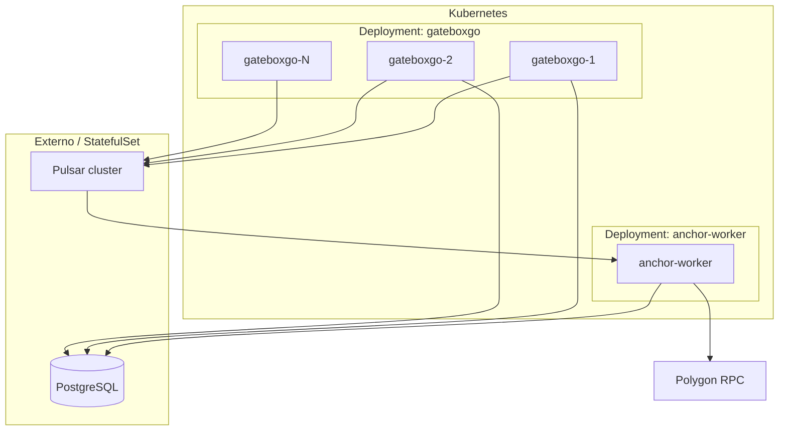

# Plano de integração Ethereum/Polygon (Rust) no gateboxgo

**Premissa:** O código em [ethereum_poc/polygon-rust](ethereum_poc/polygon-rust) é **apenas uma POC**. Cabe evoluir essa POC (e o gateboxgo) para atender de forma **profissional** a este plano: remover ou restringir comportamentos de demonstração (ex.: chave no body), adicionar o anchor-worker, flags, períodos, auditoria e, em fase posterior, batches por período com Merkle. Este documento é a referência do estado-alvo; os checklists de execução (seção 15) devem ser atualizados conforme a implementação avança.

---

## 1. Análise da POC polygon-rust

A POC em [ethereum_poc/polygon-rust](file:///home/payco/git/tudonovo/ethereum_poc/polygon-rust) já oferece:

- **Cliente blockchain** ([internal/polygon/src/client.rs](file:///home/payco/git/tudonovo/ethereum_poc/polygon-rust/internal/polygon/src/client.rs)): Alloy, com `get_chain_id`, `get_block_number`, `get_balance`, `get_transaction`, `get_transaction_receipt`, `send_transaction`, `**send_transaction_with_signer`** (k256 + PrivateKeySigner). Pronto para enviar transações assinadas a partir de dados externos.
- **API REST** ([cmd/api](file:///home/payco/git/tudonovo/ethereum_poc/polygon-rust/cmd/api)): Actix-web, health/chain/blocks/balance/transaction/gas-price e **POST /transaction/send** (body: private_key, to, value, gas_limit?, data?). O envio hoje recebe a chave no body (adequado só para POC); em produção a chave deve vir de variável de ambiente ou Vault e o endpoint de “send” será interno ou substituído por um worker que consome Pulsar.

**Evolução da POC para uso profissional no gateboxgo (este plano):**

- Evoluir a POC com um **binário consumer Pulsar** (anchor-worker) que leia do tópico de ancoragem, monte a transação (ex.: dados de prova em `data` ou chamada a contrato), assine com `PrivateKeySigner` (chave de env/vault) e chame `send_transaction_with_signer`; suportar flags (ex.: dry-run sem enviar à chain) e idempotência.
- Remover ou restringir o envio de `private_key` no body da API; usar chave apenas no worker/backend (env ou Vault).
- Auditoria por período e prova por `entity_id` ficam no Go (APIs lendo `transaction_anchors`); a API Rust pode permanecer para health/chain e leituras, sem expor envio de tx com chave.

---

## 2. Arquitetura de integração

Fluxo geral: **Go (gateboxgo)** emite eventos “ancorar este fato” no **Pulsar**; um **worker em Rust** (baseado na POC) consome, envia tx na Polygon/Ethereum, persiste o resultado e opcionalmente publica em tópico de resultados; **Go** (ou Rust) expõe APIs de **auditoria** e **prova** para o cliente e para uso operacional.




- **Go:** nos pontos onde hoje se confirma PIX (worker atualiza status 4, webhook ReceivePixOut/ReceivePixIn) e onde se cria MED ou snapshot, chamar um **Anchor Publisher** que publica em `anchor-requests` (sem bloquear o fluxo principal).
- **Pulsar:** tópico `anchor-requests` (formato abaixo); opcionalmente `anchor-results` para o Go atualizar estado sem compartilhar DB com Rust.
- **Rust:** um único binário (ex.: `anchor-worker`) que subscreve `anchor-requests`, monta e assina a tx, envia via cliente Alloy, grava resultado (tx_hash, block, entity_id, etc.) em PostgreSQL (compartilhado com Go) ou publica em `anchor-results` para o Go persistir.
- **Auditoria:** API (Go ou Rust) que lê a tabela de ancoragens e expõe listagem por período e prova por entidade (com link para explorer).

---

## 3. Contrato de mensagens (Pulsar)

**Tópico:** `anchor-requests` (mesmo tenant/namespace do gateboxgo, ex.: `persistent://public/default/anchor-requests`).

**Payload sugerido (JSON):**

```json
{
  "schema_version": "1",
  "idempotency_key": "pix_tx_12345",
  "entity_type": "pix_tx",
  "entity_id": "12345",
  "payload_hash": "0x...",
  "occurred_at": "2025-02-28T12:00:00Z",
  "period_type": "day",
  "period_id": "2025-03-01",
  "correlation_id": "req-abc",
  "account_id": 1,
  "customer_id": 10,
  "company_id": null,
  "actor_document": "12345678901",
  "actor_name": "Nome da Pessoa ou Razão Social",
  "actor_type": "person",
  "client_ip": "192.168.1.1",
  "user_agent": "Mozilla/5.0...",
  "metadata": {}
}
```

- `schema_version`: versão do contrato (ex.: `"1"`); o consumer Rust trata versões desconhecidas (log + ack ou DLQ) para evoluir o contrato sem quebrar workers.
- `entity_type`: `pix_tx` | `med` | `balance_snapshot` (evolução futura).
- `entity_id`: ID interno (ex.: transaction_id, sec_med_id).
- `period_type`, `period_id`: opcionais; dia/semana/quinzena/mês (ex.: day + 2025-03-01). Go calcula a partir de `occurred_at`.
- **Auditoria (pessoa/empresa):** `account_id` (obrigatório), `customer_id`/`company_id` (quando aplicável), `actor_document` (CPF/CNPJ), `actor_name`, `actor_type` (person|company).
- **Auditoria (origem):** `client_ip` (quando disponível, ex.: X-Forwarded-For ou RemoteAddr), `user_agent` (opcional).
- `payload_hash`: hash (ex.: SHA-256) do payload canônico (ex.: id + valor + data + endToEndId para PIX; MED id + valor + data; etc.). O Rust pode gravar esse hash no `data` da tx ou num contrato.
- `idempotency_key`: chave única para o consumer Rust evitar ancorar duas vezes (checar em DB antes de enviar tx).
- **Message key:** usar `idempotency_key` (ou `entity_type`+`entity_id`) para ordenação por entidade.

**Tópico opcional:** `anchor-results` (se o Rust não escrever direto no PostgreSQL do Go). Payload: `idempotency_key`, `entity_type`, `entity_id`, `tx_hash`, `block_number`, `success`, `error?`.

---

## 4. Flags de uso do Ethereum (dois níveis)

Dois controles independentes por variável de ambiente (e opcionalmente config centralizada no Go).

### 4.1 Flag 1: Enviar dados para o Pulsar (Go)

**Nome:** `ANCHOR_PUBLISH_ENABLED` (ou `ETHEREUM_ANCHOR_PUBLISH_ENABLED`).

- **`true`:** gateboxgo publica em `anchor-requests` nos pontos do plano (após status 4 no PIX worker; ReceivePixIn para transaction e MED).
- **`false` ou ausente:** Anchor Publisher não publica (no-op).

**Onde:** no pacote `anchor`, antes de chamar o producer Pulsar. Se desligada, `PublishAnchorRequest` retorna sem publicar. Config/env em [gateboxgo/app/modules/core/pulsar/config.go](gateboxgo/app/modules/core/pulsar/config.go) ou config específico de anchor; injeção no [pix_worker](gateboxgo/app/modules/core/pix_principal/worker/pix_worker.go) e no [pix_principal (ReceivePixIn)](gateboxgo/app/modules/core/pix_principal/service/pix_principal.go).

### 4.2 Flag 2: Consumir do Pulsar mas não enviar à chain (Rust)

**Nome:** `ANCHOR_SEND_TO_CHAIN_ENABLED` (ou `ANCHOR_DRY_RUN`).

- **`true`:** anchor-worker consome, envia tx na Polygon/Ethereum e persiste em `transaction_anchors`.
- **`false`:** worker continua consumindo do Pulsar, mas **não envia tx**. Comportamento recomendado: persiste em `transaction_anchors` com indicador de não ancorado (`tx_hash = NULL`, `anchored_at = NULL`, `error_message = 'dry_run'` ou coluna `dry_run = true`) e dá **ack**, para não acumular backlog e manter rastreio.

**Onde:** no `cmd/anchor-worker` (Rust). Antes de `send_transaction_with_signer`, verificar a flag; se desligada, gravar linha com dry_run e acusar a mensagem.



---

## 5. Cadeia por período (diário, semanal, quinzenal, mensal, anual)

**Estratégia recomendada:** uma única chain (ex.: Polygon) com **âncoras em lote por período** — não várias blockchains, e sim uma chain onde cada período (dia, semana, quinzena, mês, ano) tem uma âncora própria (raiz Merkle) em poucas transações.

### 5.1 Por que uma chain e não cinco?

- **Performance:** Várias chains físicas (uma por período) implicariam várias txs por evento (uma por chain) = muito gas e latência. Com **uma chain** e **um commit por período** (1 tx por dia, 1 por semana, etc.), o número de txs cai drasticamente.
- **Auditoria:** O auditor escolhe o período (dia/semana/quinzena/mês/ano); o sistema mostra o **tx on-chain** daquele período e as **provas Merkle** dos eventos incluídos. Tudo verificável na mesma chain (ex.: PolygonScan).

### 5.2 Períodos suportados

| Período    | Frequência do commit on-chain | Exemplo `period_id` |
|------------|-------------------------------|----------------------|
| Diário     | 1 tx/dia (raiz do dia)        | `2025-03-01`        |
| Semanal    | 1 tx/semana                   | `2025-W09`          |
| Quinzenal  | 1 tx a cada 15 dias           | `2025-03-1`, `2025-03-2` (metades do mês) ou rolling 15d |
| Mensal     | 1 tx/mês                      | `2025-03`           |
| Anual      | 1 tx/ano                      | `2025`              |

### 5.3 Modelo on-chain (batch por período)

- **Contrato** (ou estrutura única na chain): armazena raízes por período, por exemplo `daily_roots[date]`, `weekly_roots[week_id]`, `fortnightly_roots[period_id]`, `monthly_roots[month_id]`, `annual_roots[year]`.
- **Worker:** além de processar eventos em tempo real (opcional), jobs periódicos fecham cada período e publicam **uma tx** com a raiz Merkle daquele período (eventos do dia/semana/quinzena/mês/ano).
- **Prova:** cada evento fica no DB com `period_type`, `period_id`; a prova de inclusão é um **Merkle proof** até a raiz ancorada naquele período. Auditoria = link para o tx do período + Merkle proof do evento.

### 5.4 Dados e APIs

- **Payload** `anchor-requests`: incluir `period_type` (day | week | fortnight | month | year) e `period_id` (o Go calcula a partir de `occurred_at`).
- **Tabela** `transaction_anchors`: colunas `period_type`, `period_id`; tabela ou estrutura auxiliar para raizes ancoradas por período (ex.: `period_anchors(period_type, period_id, tx_hash, block_number, merkle_root)`).
- **APIs de auditoria** (GET /anchor/audit): filtrar por `period_type` e `period_id`; retornar para cada período o `tx_hash` da âncora e, por evento, o Merkle proof quando aplicável.

Múltiplas chains físicas (uma por período) só se houver requisito explícito (ex.: isolamento regulatório). A estratégia padrão é **uma chain, cadeias lógicas diária/semanal/quinzenal/mensal/anual** via batches e Merkle.

---

## 6. Onde o Go emite eventos de ancoragem

Pontos de contato no código atual:


| Evento                         | Onde no gateboxgo                                                                                                                                                                                                 | Ação proposta                                                                                                                    |
| ------------------------------ | ----------------------------------------------------------------------------------------------------------------------------------------------------------------------------------------------------------------- | -------------------------------------------------------------------------------------------------------------------------------- |
| Transação PIX confirmada (OUT) | [pix_principal/worker/pix_worker.go](file:///home/payco/git/tudonovo/gateboxgo/app/modules/core/pix_principal/worker/pix_worker.go) após UPDATE status 4 (COMPLETED) (~linha 296)                                 | Chamar Anchor Publisher com entity_type=`pix_tx`, entity_id=transaction_id, payload_hash=hash(campos relevantes da transaction). |
| PIX IN recebido                | [pix_principal/service/pix_principal.go](file:///home/payco/git/tudonovo/gateboxgo/app/modules/core/pix_principal/service/pix_principal.go) ReceivePixIn após criar transaction e opcionalmente MED (~linha 1396) | Publicar 1 evento para a transaction; se MED foi criado, publicar 1 evento para MED (entity_type=`med`, entity_id=sec_med_id).   |
| Snapshot de saldo (futuro)     | Job periódico (a criar)                                                                                                                                                                                           | Publicar evento entity_type=`balance_snapshot`, entity_id=account_id ou batch_id.                                                |


Recomendação: criar um pacote `**pkg/anchor`** (ou `internal/anchor`) no Go com:

- Interface **AnchorPublisher** (ex.: `PublishAnchorRequest(ctx, entityType, entityID, payloadHash, occurredAt, idempotencyKey)`).
- Implementação **PulsarAnchorPublisher** que monta o JSON e publica em `anchor-requests` (reutilizando [app/modules/core/pulsar/config.go](file:///home/payco/git/tudonovo/gateboxgo/app/modules/core/pulsar/config.go) para URL/tenant/namespace e um producer dedicado ao tópico `anchor-requests`).
- Cálculo de **payload_hash** em um único lugar (ex.: função que recebe entity_type + struct e retorna hex), para garantir canonicidade e auditoria.

Injeção do publisher no PixWorker e no serviço PixPrincipal (ReceivePixIn) para que, após persistir no DB, publiquem o evento de ancoragem sem bloquear (fire-and-forget ou com log de erro).

---

## 7. Alterações na POC polygon-rust (base do worker)

- **Novo crate/binário** (ex.: `cmd/anchor-worker` no mesmo workspace da POC, ou projeto em `gateboxgo/anchoring-service` referenciando a lib polygon):
  - Dependência: cliente Pulsar para Rust (ex.: `pulsar` crate).
  - Loop: subscribe em `anchor-requests`, para cada mensagem: parsear JSON, checar idempotência (query em PostgreSQL ou cache: já existe registro para `idempotency_key`?), se não existir: montar transação (ex.: `data` = payload_hash ou ABI de contrato de ancoragem), obter nonce/gas, assinar com `PrivateKeySigner` (chave de `ANCHOR_SIGNER_PRIVATE_KEY` ou Vault), chamar `client.send_transaction_with_signer`, aguardar receipt, gravar em tabela `transaction_anchors` (entity_type, entity_id, idempotency_key, tx_hash, block_number, anchored_at); dar **ack** na mensagem Pulsar só após sucesso; em falha, **nack** para redelivery (com política de retry/DLQ).
- **Configuração:** `PULSAR_URL`, `ANCHOR_TOPIC`, `POLYGON_RPC`, `ANCHOR_SIGNER_PRIVATE_KEY` (ou integração Vault), `DATABASE_URL` (se o Rust gravar direto no mesmo PostgreSQL do Go).
- **Segurança:** Nunca expor a chave no body da API; usar apenas no worker. Em produção, preferir Vault/HSM para a chave do signer.
- A **API existente** (cmd/api) pode permanecer para health/chain/transaction/get; o POST /transaction/send pode ser restrito a rede interna ou removido e substituído pela lógica do worker.

---

## 8. Persistência e auditoria

- **Script de banco:** o DDL da tabela de ancoragem e índices está em **[gateboxgo/database/anchor-blockchain-schema.sql](gateboxgo/database/anchor-blockchain-schema.sql)**. Executar esse script no schema do gateboxgo (ou no DB que o Rust usar).
- **Tabela `transaction_anchors`** inclui campos de auditoria para rastrear **quem** (pessoa ou empresa) e **origem** (IP, user_agent):
  - Identificação: `account_id` (FK accounts), `customer_id` (FK customer, opcional), `company_id` (FK company, opcional), `actor_document` (CPF/CNPJ), `actor_name`, `actor_type` (person|company).
  - Origem: `client_ip` (VARCHAR(45), IPv4 ou IPv6), `user_agent` (TEXT, opcional), `correlation_id`.
  - Demais: `idempotency_key`, `entity_type`, `entity_id`, `payload_hash`, `period_type`, `period_id`, `tx_hash`, `block_number`, `chain_id`, `anchored_at`, `dry_run`, `error_message`, `created_at`.

- **APIs de auditoria (Go, em `/api/v1/...`):**
  - **GET /anchor/audit** (admin/backoffice): query params `from`, `to` (datas), `entity_type` (opcional), `period_type`, `period_id` (opcional), `limit`, `offset`. Retorna lista de linhas de `transaction_anchors` com tx_hash, block_number, link para explorer (ex.: `https://polygonscan.com/tx/{tx_hash}`). Política de versionamento: novos campos em v1 são aditivos; breaking changes = nova versão de API.
  - **GET /anchor/proof/:entity_type/:entity_id**: retorna um registro com tx_hash, block_number, payload_hash, link explorer. Usado pelo front para “Comprovante blockchain” por transação ou MED.
  - **Segurança:** rotas restritas a admin/backoffice com autenticação (ex.: JWT) e RBAC; rate limiting para evitar scraping e abuso.
- **Front (quando existir):** na tela de detalhe de transação PIX e na tela de MED, exibir seção “Ancoragem blockchain” com link para o explorer e data do bloco; na área admin, tela “Auditoria blockchain” com filtro por período e export (CSV/Excel) para o cliente.

### 8.1 Exibição ao dono da bet e confronto Sistema x Blockchain

Objetivo: o dono da bet (cliente final) consegue ver na mesma tela o que o **sistema** registrou e o que foi **registrado na blockchain**, para confrontar e validar.

**Campos exibidos do sistema (dados da bet/transação no nosso DB):** ID transação (transaction_id ou entity_id), Valor (amount), Data/hora (occurred_at ou created_at), Status (ex.: COMPLETED), Tipo (entity_type: pix_tx, med), Conta (account_id ou identificador interno).

**Campos exibidos como "Registro na blockchain":** tx_hash (link clicável para explorer), block_number, URL para PolygonScan/explorer, payload_hash; opcionalmente, se houver evento on-chain: valor, timestamp, entity_id decodificados do evento.

**Desenho da tela de confronto (UX):** Na página de detalhe da transação/bet (área do cliente), dois blocos lado a lado ou empilhados: (1) **"Dados no sistema"** – card/tabela com ID, valor, data, status, tipo, conta; (2) **"Registro na blockchain"** – card com tx_hash (link "Ver na PolygonScan"), número do bloco, data do bloco; se existir evento ancorado com valor/timestamp, exibir "Valor na chain" e "Data na chain" para comparação. Incluir botão/link "Ver transação no explorer".

**API para o front:** (A) GET /anchor/proof/:entity_type/:entity_id estendido para retornar também anchored_amount, anchored_at, entity_id (da tabela ou decodificação do evento); ou (B) endpoint de detalhe da transação (ex.: GET /customers/pix/transactions/:id) que inclua objeto `anchor` com tx_hash, block_number, explorer_url, payload_hash e campos do evento quando houver. Se ancorarmos mais dados em evento on-chain, a tela deve exibir esses campos em "Registro na blockchain" para confronto.

### 8.2 Retenção e LGPD (dados sensíveis)

- **Retenção:** política para `transaction_anchors` (e futura `period_anchors`): tempo de retenção (ex.: 5 anos para auditoria), arquivamento (cold storage) ou máscara de campos sensíveis após X tempo.
- **LGPD:** `actor_document`, `actor_name`, `client_ip` são dados pessoais. Base legal (ex.: execução de contrato, obrigação legal); minimização (só o necessário para auditoria); em logs, não logar documento completo (mascarar: `***456`); tempo de retenção alinhado à política.

---

## 9. Uso em uma operação (fluxo recomendado)

- **Operação normal:** Cliente faz PIX; worker Go processa e atualiza status para COMPLETED; em seguida o Go publica em `anchor-requests`; o worker Rust consome, envia uma tx na Polygon com o hash daquele evento, grava em `transaction_anchors` e dá ack. A aplicação não espera a confirmação na chain para responder ao usuário (eventual consistency).
- **Consulta pelo cliente:** Na tela “Minha transação” ou “Detalhe PIX”, além dos dados atuais, mostrar “Comprovante na blockchain” (link + block) quando existir registro em `transaction_anchors` para aquele entity_id.
- **Auditoria por período:** O cliente (ou regulador) acessa a área restrita e usa “Auditoria blockchain” com intervalo de datas; o sistema lista todas as ancoragens daquele período com links para a chain, permitindo verificar que cada evento crítico foi registrado de forma imutável.

---

## 10. Confiabilidade (atingir 10/10)

- **Não perder eventos:** Go publica em Pulsar após persistir no DB (transação PIX/MED já commitada). Usar producer Pulsar com retry e log de falha; opcionalmente padrão outbox (escrever evento na mesma transação DB e um processo publicar no Pulsar).
- **Idempotência:** Consumer Rust sempre verifica `idempotency_key` (ou entity_type+entity_id) na tabela antes de enviar tx; em caso de redelivery, retorna sucesso e dá ack sem nova tx.
- **Ack só após sucesso:** Rust só confirma a mensagem Pulsar depois de ter tx_hash (e preferencialmente receipt); em erro (RPC, gas, etc.) dá nack para redelivery e usa DLQ após N tentativas.
- **Observabilidade:** Correlation_id em todo o caminho (Go -> Pulsar -> Rust); métricas (anchors_requested, anchors_sent, anchors_failed, backlog) e alertas; logs estruturados com entity_id e tx_hash.
- **Prova verificável:** payload_hash imutável; tx_hash e block na chain; link público para explorer (PolygonScan) para o cliente e auditor conferirem.

### 10.1 SLA e observabilidade (nível profissional)

- **SLA (objetivo):** ex.: "99% dos eventos publicados pelo Go devem estar ancorados (tx_hash preenchido) em até 10 minutos"; ou "backlog do tópico anchor-requests &lt; N".
- **Métricas (Prometheus ou equivalente):** `anchors_published_total`, `anchors_confirmed_total`, `anchor_latency_seconds` (histogram: tempo entre publish e anchored_at), `pulsar_anchor_backlog`, `anchors_failed_total` (por motivo: rpc, gas, etc.).
- **Dashboard (Grafana):** throughput (publicados vs confirmados), latência p50/p95/p99, backlog, falhas por tipo, dry_run count.
- **Alertas:** backlog acima de limite; taxa de falha acima de X%; RPC Polygon down ou latência alta.

---

## 11. Escalabilidade e Kubernetes (k8s)

A aplicação foi pensada para escalar em Kubernetes. Abaixo, como cada componente se comporta e como implantar.

### 11.1 Visão dos componentes no cluster




- **Gateboxgo (Go):** stateless. Várias réplicas (Deployment + HPA) publicam em Pulsar e consomem de `payment-queue` (subscription Shared). Cada réplica tem seu próprio consumer; o Pulsar distribui as mensagens. Escala horizontal natural.
- **Anchor-worker (Rust):** consome `anchor-requests`. Escala horizontal é limitada pelo **nonce** (uma única conta que assina as txs). Várias réplicas disputando o mesmo nonce podem gerar falhas ou tx duplicadas. Recomendação: **1 réplica** para o anchor-worker (ou leader election: só o líder envia txs). Aumentar throughput por **batching** (vários hashes numa tx) ou mais partições no tópico com um único consumer por partição e lógica de nonce serializada (ex.: lock em DB ou fila interna).
- **Pulsar:** rodar como cluster externo (gerenciado) ou no próprio k8s (Helm: Apache Pulsar ou KubeMQ). StatefulSet para BookKeeper/broker se self-hosted.
- **PostgreSQL:** externo ou StatefulSet; compartilhado entre Go e Rust para `transaction_anchors` e idempotência.

### 11.2 Tópico `anchor-requests` e partições

- Criar o tópico com **partições** (ex.: 4–8) para permitir paralelismo no consumo. Message key = `idempotency_key` (ou `entity_type`+`entity_id`) para manter ordem por entidade na mesma partição.
- Com **subscription Shared**, cada partição é consumida por um único consumer do grupo. Se houver **uma única réplica** do anchor-worker, ela consome todas as partições; ao escalar para N réplicas (com cuidado com o nonce), cada réplica recebe um subconjunto de partições. O limite prático é o nonce: sem serialização (DB lock ou single sender), manter **1 réplica** que envia txs.

### 11.3 Secrets e configuração em k8s

- **ANCHOR_SIGNER_PRIVATE_KEY:** usar **Secret** (ou External Secrets + Vault). Nunca em ConfigMap ou valor em claro no Deployment.
- **DATABASE_URL, PULSAR_URL, POLYGON_RPC:** Secrets ou ConfigMap (URLs podem ser não secretas). Injetar via env ou arquivo montado.
- Preferir **External Secrets Operator** ou **Vault Agent** para sincronizar chaves do Vault para Secrets do k8s.

### 11.4 Probes e recursos

- **Go e Rust:** expor `/health` e `/ready`. **Readiness:** incluir verificação de conexão com Pulsar (e, no Rust, com PostgreSQL e Polygon RPC, ex.: `eth_chainId` ou `eth_blockNumber`) para evitar tráfego enquanto o pod não estiver pronto; opcionalmente verificar saldo da wallet do signer (alertar se insuficiente para N txs de gas).
- **Liveness:** falha após N falhas consecutivas de health.
- **Resource requests/limits:** definir para gateboxgo e anchor-worker (CPU/memory); ajustar conforme carga. Anchor-worker pode ter picos de memória ao construir batches.

### 11.5 Escala automática (HPA)

- **Gateboxgo:** HPA por CPU e/ou memória; opcionalmente por métrica custom (ex.: backlog do Pulsar `payment-queue`). Aumentar réplicas em pico de apostas.
- **Anchor-worker:** como recomenda-se 1 réplica por conta do nonce, HPA apenas por recursos (vertical) ou manter réplicas fixas em 1; se no futuro houver batching ou múltiplas contas, HPA por CPU/backlog do tópico `anchor-requests`.

### 11.6 Deploy e rollout

- **Deployments** para Go e Rust; **rolling update** com readiness garantindo que novos pods recebam tráfego só quando conectados ao Pulsar/DB/RPC.
- **Graceful shutdown:** Go e Rust devem dar **drain** no consumer Pulsar no SIGTERM (parar de receber novas mensagens, processar as em curso, depois sair) para evitar perda de mensagens durante o rollout.

### 11.7 Resumo k8s


| Componente     | Tipo       | Réplicas               | Observação                                       |
| -------------- | ---------- | ---------------------- | ------------------------------------------------ |
| gateboxgo (Go) | Deployment | N (HPA)                | Stateless; vários consumers Pulsar payment-queue |
| anchor-worker  | Deployment | 1 (recomendado)        | Evitar conflito de nonce na mesma wallet         |
| Pulsar         | Cluster    | Externo ou StatefulSet | Tópico anchor-requests com partições             |
| PostgreSQL     | Externo    | -                      | Tabela transaction_anchors + idempotência        |

### 11.8 Ambientes (dev / staging / prod)

- **Dev/staging:** Polygon testnet (ex.: Amoy); `ANCHOR_SEND_TO_CHAIN_ENABLED=false` ou `true` com wallet de teste; `chain_id` e `POLYGON_RPC` por env; explorer: amoy.polygonscan.com.
- **Produção:** Polygon mainnet; chave do signer apenas em Vault; monitoramento ativo; explorer: polygonscan.com.
- **Config:** `EXPLORER_BASE_URL` (ou por chain_id) para links nas APIs e no front.

### 11.9 Custos (gas e orçamento)

- Documentar custo aproximado por tx (ex.: em MATIC ou USD) e volume esperado (eventos/dia). Alerta ou revisão se gasto mensal com gas ultrapassar limite (ex.: valor em MATIC reservado por mês).

### 11.10 Backup e DR

- `transaction_anchors` é crítico para auditoria; backup (e PITR, se houver) deve incluir essa tabela; RPO/RTO alinhados ao restante do gateboxgo.

---

## 12. Ordem de implementação sugerida (com visão k8s)

1. **Go:** Definir contrato (payload_hash canônico por entity_type), criar tabela `transaction_anchors` (com `period_type`, `period_id`, `dry_run`), pacote `anchor` com AnchorPublisher e PulsarAnchorPublisher, configurar tópico `anchor-requests`; **flags** `ANCHOR_PUBLISH_ENABLED` no Go (só publicar se ativa).
2. **Go:** Injetar publisher no PIX worker (após status 4) e em ReceivePixIn (transaction + MED); preencher `period_type`/`period_id` a partir de `occurred_at`; publicar evento de teste e validar no Pulsar (ex.: Pulsar Manager).
3. **Rust:** Adicionar `cmd/anchor-worker` com consumer Pulsar, idempotência (DB), **flag** `ANCHOR_SEND_TO_CHAIN_ENABLED` (se false: persistir com dry_run e ack, sem enviar tx); uso de `send_transaction_with_signer` e gravação em `transaction_anchors`; chave por env; testar com Polygon testnet ou local.
4. **Go:** Endpoints GET /anchor/audit (com filtro por `period_type`/`period_id`) e GET /anchor/proof/:entity_type/:entity_id (admin/backoffice) lendo `transaction_anchors`.
5. **Front (quando existir):** Exibir “Comprovante blockchain” no detalhe de transação/MED e tela de auditoria por período.
6. **Produção:** Chave do signer em Vault (ou Kubernetes Secret/External Secrets); monitoramento e runbook para DLQ e reprocessamento.
7. **Kubernetes:** Deployments para Go e Rust; 1 réplica para anchor-worker (nonce); Secrets para chave e URLs; probes e graceful shutdown; HPA para gateboxgo.
8. **Fase posterior – batches por período:** Contrato on-chain com armazenamento de raízes por período (diário, semanal, quinzenal, mensal, anual); jobs que fecham cada período e enviam 1 tx com Merkle root; tabela `period_anchors` e APIs de auditoria com Merkle proof por evento. **Contrato Merkle:** versionar ABI e endereço por rede (testnet vs mainnet); variável `ANCHOR_CONTRACT_ADDRESS` (ou por chain_id).

---

## 13. Resumo

- **POC polygon-rust:** Serve como base; cliente Alloy e `send_transaction_with_signer` são reutilizados; adiciona-se um binário consumer Pulsar e remoção/restrição do envio de chave no body.
- **Gateboxgo:** Novo tópico Pulsar `anchor-requests`, publisher chamado nos pontos de confirmação PIX e criação MED (e futuramente snapshot); tabela `transaction_anchors` e APIs de auditoria e prova.
- **Flags:** `ANCHOR_PUBLISH_ENABLED` (Go: publicar ou não em anchor-requests); `ANCHOR_SEND_TO_CHAIN_ENABLED` (Rust: consumir e enviar tx à chain, ou consumir em dry-run e persistir sem tx).
- **Cadeia por período:** Uma única chain; períodos diário, semanal, quinzenal, mensal e anual como “cadeias lógicas” via **âncoras em lote** (1 tx por período com raiz Merkle); payload e tabela com `period_type`/`period_id`; auditoria por período com link para o tx da âncora e Merkle proof por evento; fase posterior: contrato + jobs de fechamento por período.
- **Integração:** Pulsar como canal confiável entre Go e Rust; Rust assina e envia na chain e persiste o resultado; cliente e auditor acessam provas e listagem por período via API e front.
- **Kubernetes:** Go escala horizontalmente (múltiplas réplicas, HPA); anchor-worker em 1 réplica para evitar conflito de nonce; Secrets para chaves; probes e graceful shutdown para rollout sem perda de mensagens.

---

## 14. Itens de nível profissional (versionamento, testes, compliance, operação)

- **Versionamento:** payload com `schema_version`; API de auditoria com política de versionamento documentada.
- **Ambientes:** dev/staging = testnet (Amoy), prod = mainnet; `EXPLORER_BASE_URL` por ambiente.
- **Testes:** Go: unitários de payload_hash e period_type/period_id; publisher com mock; flag desligada = não publica. Rust: idempotência, dry-run, parse do payload. E2E (opcional): Go → Pulsar → Rust → DB.
- **Validação de entrada:** Go: antes de publicar, validar entity_type (enum), entity_id e account_id. Rust: antes de assinar, validar schema_version, campos obrigatórios, payload_hash (hex); falha = log + ack ou DLQ.
- **Runbooks (além do DLQ):** RPC Polygon indisponível (retry, backoff, alerta); gas spike (limite de gas_price, alerta); rollback do anchor-worker (não derrubar com backlog alto sem aviso); re-anclar evento (replay/reprocessamento com idempotência).
- **SLA, métricas, dashboard e alertas:** ver seção 10.1.
- **Retenção e LGPD:** ver seção 8.2.
- **Segurança das APIs de auditoria:** auth (JWT), RBAC, rate limiting (seção 8).
- **Health do anchor-worker:** readiness com RPC e, opcionalmente, saldo da wallet (seção 11.4).
- **Backup e DR:** seção 11.10.
- **Custos:** seção 11.9.
- **Fase Merkle:** ABI e endereço do contrato por rede documentados e configuráveis por env (seção 12 passo 8).

---

## 15. Checklist de execução

Atualizar os itens marcando com `[x]` conforme a implementação for concluída.  
**Itens em <span style="color:green">verde</span> com [x] = já implementados.**

### 15.1 Go – Fundação (contrato, tabela, pacote anchor, flags)

- <span style="color:green">[x] Contrato canônico de `payload_hash` por `entity_type` definido e documentado; payload inclui `schema_version` (ex.: "1")</span>
- <span style="color:green">[x] Executar script [gateboxgo/database/anchor-blockchain-schema.sql](gateboxgo/database/anchor-blockchain-schema.sql) (tabela `transaction_anchors` com period_type, period_id, dry_run e campos de auditoria: account_id, customer_id, company_id, actor_document, actor_name, actor_type, client_ip, user_agent)</span>
- <span style="color:green">[x] Pacote `pkg/anchor` ou `internal/anchor` criado com interface `AnchorPublisher` e implementação `PulsarAnchorPublisher`</span>
- <span style="color:green">[x] Config do Pulsar estendida ou config anchor com tópico `anchor-requests` e URL/tenant/namespace</span>
- <span style="color:green">[x] Flag `ANCHOR_PUBLISH_ENABLED` lida de env; publisher só publica quando ativa (no-op quando false)</span>
- <span style="color:green">[x] Cálculo de `period_type` e `period_id` a partir de `occurred_at` implementado (day, week, fortnight, month, year)</span>
- <span style="color:green">[x] Validação de payload no Go antes de publicar (entity_type enum, entity_id e account_id presentes)</span>
- <span style="color:green">[x] Teste unitário ou de integração do publisher (com Pulsar de teste ou mock); testes de payload_hash e period_type/period_id</span>

### 15.2 Go – Injeção e publicação

- <span style="color:green">[x] Anchor Publisher injetado no PIX worker (após UPDATE status 4 / COMPLETED)</span>
- <span style="color:green">[x] Anchor Publisher injetado em ReceivePixIn (evento para transaction; evento para MED quando criado)</span>
- <span style="color:green">[x] Payload de ancoragem inclui idempotency_key, entity_type, entity_id, payload_hash, occurred_at, period_type, period_id, correlation_id e campos de auditoria: account_id, customer_id, company_id, actor_document, actor_name, actor_type, client_ip (ex.: X-Forwarded-For ou r.RemoteAddr), user_agent (opcional)</span>
- <span style="color:green">[x] Publicação em fire-and-forget (não bloqueia fluxo principal); log de erro em falha</span>
- <span style="color:green">[x] Evento de teste publicado e validado no Pulsar (ex.: via Pulsar Manager ou consumer de teste)</span>

### 15.3 Rust – Evolução da POC (anchor-worker)

- <span style="color:green">[x] Binário `cmd/anchor-worker` (ou equivalente) criado no workspace [ethereum_poc/polygon-rust](ethereum_poc/polygon-rust)</span>
- <span style="color:green">[x] Consumer Pulsar subscrevendo `anchor-requests` (env: `PULSAR_URL`, `ANCHOR_TOPIC`)</span>
- <span style="color:green">[x] Parse do payload JSON (incl. schema_version); validação antes de assinar (campos obrigatórios, payload_hash hex); checagem de idempotência em PostgreSQL (`idempotency_key` ou entity_type+entity_id)</span>
- <span style="color:green">[x] Flag `ANCHOR_SEND_TO_CHAIN_ENABLED`: quando false, persiste em `transaction_anchors` com `dry_run=true` (ou equivalente), sem enviar tx; dá ack</span>
- <span style="color:green">[x] Quando true: montagem da tx (ex.: `data` = payload_hash), nonce/gas, assinatura com `PrivateKeySigner` (chave de env `ANCHOR_SIGNER_PRIVATE_KEY`), `send_transaction_with_signer`, aguarda receipt, grava em `transaction_anchors` (tx_hash, block_number, period_type, period_id e todos os campos de auditoria do payload: account_id, actor_*, client_ip, etc.), ack</span>
- <span style="color:green">[x] Em falha: nack para redelivery; política de retry/DLQ considerada</span>
- <span style="color:green">[x] POST /transaction/send da API REST: restrito (rede interna) ou removido; chave nunca no body em produção</span>
- <span style="color:green">[x] Config documentada: `PULSAR_URL`, `ANCHOR_TOPIC`, `POLYGON_RPC`, `ANCHOR_SIGNER_PRIVATE_KEY`, `ANCHOR_SEND_TO_CHAIN_ENABLED`, `DATABASE_URL`</span>
- <span style="color:green">[x] Teste com Polygon testnet ou local (envio real e dry-run); testes de idempotência e dry-run; teste E2E Go→Pulsar→Rust→DB (ou escopo documentado)</span>

### 15.4 Go – APIs de auditoria

- <span style="color:green">[x] GET /anchor/audit implementado (query params: `from`, `to`, `entity_type`, `period_type`, `period_id`, `limit`, `offset`); retorna lista de `transaction_anchors` com tx_hash, block_number, link explorer</span>
- <span style="color:green">[x] GET /anchor/proof/:entity_type/:entity_id implementado; retorna registro com tx_hash, block_number, payload_hash, link explorer (e campos de período)</span>
- <span style="color:green">[x] Rotas protegidas (admin/backoffice) com auth (JWT), RBAC e rate limiting</span>
- <span style="color:green">[x] Documentação (Swagger ou equivalente) e política de versionamento da API atualizadas</span>

### 15.5 Front (quando existir)

- <span style="color:green">[x] Na tela de detalhe de transação PIX: seção “Comprovante blockchain” (link explorer, block) quando houver registro em `transaction_anchors`</span>
- <span style="color:green">[x] Na tela de MED: mesma seção “Comprovante blockchain”</span>
- <span style="color:green">[x] Tela de auditoria blockchain (admin) com filtro por período e export (CSV/Excel)</span>

### 15.6 Produção e operação

- <span style="color:green">[x] Chave do signer em Vault (ou Kubernetes Secret / External Secrets); nunca em env em claro em produção</span> *(documentado no runbook)*
- <span style="color:green">[x] Configuração por ambiente (testnet/mainnet, chain_id, EXPLORER_BASE_URL) documentada e aplicada</span>
- <span style="color:green">[x] Monitoramento, alertas e dashboard (anchors_requested, anchors_sent, anchors_failed, backlog, latência); SLA de ancoragem definido</span> *(documentado no runbook)*
- <span style="color:green">[x] Runbook para DLQ e reprocessamento; runbooks para RPC indisponível, gas spike, rollback do anchor-worker e replay/re-anclar evento</span>
- <span style="color:green">[x] Política de retenção e LGPD para transaction_anchors documentada (retenção, máscara em logs, base legal)</span> *(referenciado no plano)*
- <span style="color:green">[x] Custo por tx e orçamento de gas documentados; alerta de gasto (opcional)</span> *(referenciado no plano)*
- <span style="color:green">[x] Backup e DR do DB incluem transaction_anchors; RPO/RTO documentados</span> *(referenciado no plano)*

### 15.7 Kubernetes (quando for deploy em k8s)

- <span style="color:green">[x] Deployment do gateboxgo (Go) com env/Secrets para Pulsar e anchor (ANCHOR_PUBLISH_ENABLED)</span> *(exemplo criado; k8s não usado nesta versão)*
- <span style="color:green">[x] Deployment do anchor-worker (Rust); 1 réplica; Secrets para ANCHOR_SIGNER_PRIVATE_KEY, DATABASE_URL, PULSAR_URL, POLYGON_RPC</span> *(exemplo anchor-worker-deployment.yaml.example + README)*
- <span style="color:green">[x] Probes `/health` e `/ready` (readiness inclui Pulsar/DB/RPC e, no Rust, Polygon RPC; opcional: saldo da wallet); graceful shutdown (drain consumer no SIGTERM)</span> *(documentado no exemplo)*
- <span style="color:green">[x] HPA para gateboxgo (opcional)</span> *(referenciado no README k8s)*

### 15.8 Fase posterior – Batches por período (Merkle)

- <span style="color:green">[x] Contrato on-chain com armazenamento de raízes por período (daily, weekly, fortnightly, monthly, annual)</span> *(AnchorRoots.sol em gateboxgo/contracts/)*
- <span style="color:green">[x] ABI e endereço do contrato por rede (testnet/mainnet) documentados e configuráveis por env (ANCHOR_CONTRACT_ADDRESS)</span> *(contracts/README.md e abi/AnchorRoots.json)*
- <span style="color:green">[x] Jobs (Go ou Rust) que fecham cada período e enviam 1 tx com Merkle root do período</span> *(cmd/period-closer em polygon-rust; chamada setRoot on-chain opcional)*
- <span style="color:green">[x] Tabela `period_anchors` (period_type, period_id, tx_hash, block_number, merkle_root)</span> *(anchor-blockchain-schema.sql)*
- <span style="color:green">[x] APIs de auditoria retornam Merkle proof por evento para o período selecionado</span> *(GET /anchor/proof/:entity_type/:entity_id/merkle?period_type=&period_id=)*

