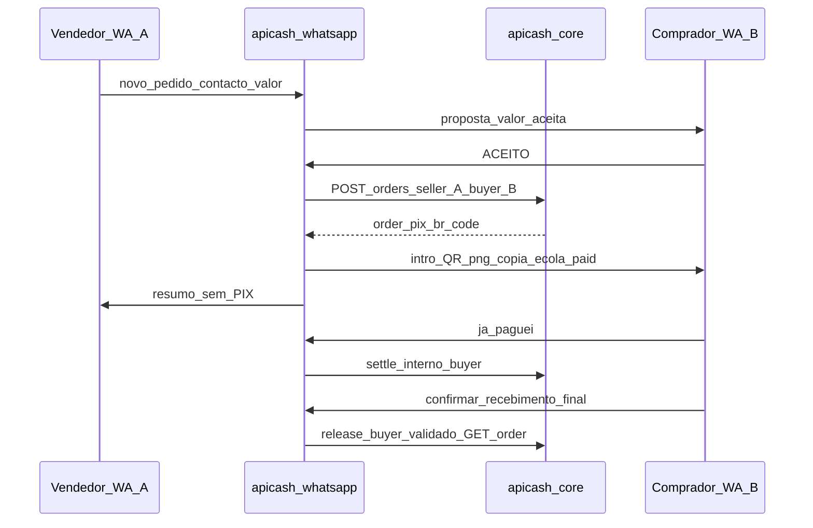

# apicash-whatsapp

**HoldFy Agent** — bot conversacional no WhatsApp que orquestra pedidos protegidos, PIX com QR Code, confirmação do comprador e fluxo simples de disputa.

## Arquitetura (alinhamento de produto)

- **Transporte acordado:** [**`whatsapp-rust`**](https://crates.io/crates/whatsapp-rust) — cliente multi-device em Rust, na mesma categoria de *stack* que **whatsmeow** (Go), **sem** depender da **Cloud API oficial da Meta** para mensagens.
- **Fluxo conversacional (vendedor A → comprador B, plataforma C):** quem fala primeiro com o número HoldFy é habitualmente **A** (**“novo pedido”**, depois contacto **B** e **valor**). A plataforma envia a **B** uma **proposta** (valor + referência); **só após B responder *ACEITO*** (ver `is_accept_proposal` em [`order_flow.rs`](src/handlers/order_flow.rs)) é chamado **`POST /orders`** e gerado o **PIX** para B. **Recusar** (`RECUSO`, *não*, *recuso*) ou **cancelar** encerra a proposta sem cobrança. O **nº de controlo** (`order_id`) só existe após aceite. **B** paga, confirma receção e liberta custódia; **A** não recebe o QR na própria sessão.
- **Núcleo de negócio (inalterado):** fila interna (`mpsc`), [`WhatsAppEvent`](src/models/whatsapp_event.rs), [`MessageHandler`](src/handlers/message_handler.rs), sessões e chamadas HTTP ao [`apicash-core`](../apicash-core) (`POST /orders`, `/internal/orders/settle`, `/custody/release`).
- **Webhook Meta (`GET/POST /webhook/whatsapp`):** caminho **auxiliar / legado** no código atual — útil para testes com payload Cloud ou integrações antigas; **não** é o alvo principal de transporte face ao alinhamento acima.
- **Multi-device:** [`service/multidevice.rs`](src/service/multidevice.rs) (`start_multidevice_bridge`) — `Event::Message` → `WhatsAppEvent` na fila `mpsc`, arrancado por `WhatsAppService` / `spawn_agent` quando `APICASH_WA_TRANSPORT` é `rust` ou `both`.

## Fluxo conversacional passo-a-passo

### Papéis (tri-partido A / B / C)

| Papel | Quem é | Como se identifica no código |
|-------|--------|-------------------------------|
| **A — vendedor** | Utilizador que inicia “novo pedido” neste número | `session.user_id` = `Uuid::new_v5` do `peer_id` WhatsApp ([`session/session_manager.rs`](src/session/session_manager.rs)) |
| **B — comprador** | Quem vai pagar o PIX | Número (texto só dígitos, 10–15 com DDI) ou **cartão de contacto**; `buyer_id` = `Uuid::new_v5` desse número |
| **C — plataforma** | `apicash-core` | Pedidos, score, custódia, liquidação; o agente chama HTTP (`CoreApiClient` em [`src/core_api.rs`](src/core_api.rs)) |

Regra documentada nas sessões: o **`user_id` da sessão de B deve ser igual ao `buyer_id`** usado no pedido para `settle` e `custody/release` com JWT de **Buyer** — não se infere comprador por texto livre.

### Estados da conversação

Definidos em [`session/session_manager.rs`](src/session/session_manager.rs) (`OrderFlowState`, `CreatingOrderStep`, `OrderDraft`). O orquestrador é [`handlers/message_handler.rs`](src/handlers/message_handler.rs); comandos de texto são reconhecidos em [`handlers/order_flow.rs`](src/handlers/order_flow.rs).

Ordem típica:

1. **`Idle`** — A envia “novo pedido” (ou equivalente).
2. **`CreatingOrder` (A)** — `AskCounterparty` (telefone/cartão de B) → `AskAmount` (valor) → `AskSellerDocument` (CPF/CNPJ do vendedor, consulta Receita via NFS-e) → proposta a B.
3. **`WaitingBuyerAccept` (A)** / **`BuyerPendingSellerProposal` (B)** — após o valor: B recebe texto de aceite (**ACEITO** / **SIM** / **gera pix** / … — ver `is_accept_proposal`). A recebe mensagem de “à espera de B”.
4. **`POST /orders` + PIX** — quando B aceita e informa **seu** CPF/CNPJ (`AwaitingBuyerDocument`): antifraude para **vendedor e comprador**, consulta Receita (nome/situação) para ambos quando `NFSE_INSCRICAO` + `NFSE_SENHA` estão no `.env`, criação do pedido com documento do comprador, PIX para B.
5. **`AwaitingPayment` (B)** — “já paguei” → `settle_order_internal` até custódia.
6. **`AwaitingConfirmation` (B)** — `confirmar recebimento` final → `release_custody`.
7. **`DisputeHint`** — disputa com `order_id` (após existir pedido).

**Recusas e cancelamentos:** respostas negativas (`is_reject_proposal`), **cancelar global** pelo B em proposta, ou **novo pedido** pelo B enquanto há proposta, limpam estado de ambos onde aplicável — A é notificado (templates `seller_buyer_refused` / `seller_proposal_cancelled_by_buyer`).

### Comandos globais

Em qualquer estado (ver início de `MessageHandler::handle_event`):

- **Cancelar** — `cancelar`, `cancel`, etc. Se **B** está em proposta (`BuyerPendingSellerProposal`), A em `WaitingBuyerAccept` é resetado quando possível e recebe texto de cancelamento pela proposta.
- **Ajuda** — `ajuda`, `help`, `menu` → bem-vindo.
- **Disputa** — ver `try_dispute` em `order_flow.rs` (só após existir `order_id` nos estados suportados).

### Chamadas HTTP à API principal (`apicash-core`) (resumo)

| Momento | Método / caminho | Autenticação |
|---------|-----------------|--------------|
| Antes de criar pedido (após aceite) | `POST …/internal/risk/score` (opcional) | `APICASH_API_KEY` onde configurado |
| Criar pedido | `POST …/orders` | Bearer **Seller** (A) |
| Comprador declara pagamento | `POST …/internal/orders/settle` | Bearer **Buyer** (B) |
| Confirmar receção | `GET …/orders/{id}` + `POST …/custody/release` | Bearer **Buyer** |

### PIX após criar pedido

Só após **`POST /orders`** (portanto só após **ACEITO**):

1. Ao **chat de B**: número de controlo, **QR** quando possível ([`qr_code.rs`](src/utils/qr_code.rs)), copia-e-cola, “já pagou?”.

2. Ao **chat de A**: pedido registado sem QR PIX.

Se não houver `pix_br_code` na resposta, ambos são avisados (sem PIX operacional).

Para **produção**, substituir/usar dados reais de antifraude; o código usa CPF sandbox fixo no request por omissão (ver `WA_ESCROW_PLACEHOLDER_CPF`).



## Variáveis de ambiente

| Variável | Descrição |
|----------|-----------|
| `APICASH_CORE_URL` | Base URL da API principal (default `http://127.0.0.1:3000`) |
| `APICASH_API_KEY` | **Recomendado** — para `POST /internal/risk/score` no fluxo em que o **vendedor (A)** inicia o pedido no WhatsApp e o **comprador (B)** é identificado por número/contacto |
| `APICASH_WA_WEBHOOK_BIND` | Bind do servidor HTTP do webhook **Cloud** (default `0.0.0.0:8080`; evitar conflito com Pulsar em `8080` — ex. `0.0.0.0:3010`) |
| `APICASH_WA_QR_PNG` | Caminho do PNG do QR de pareamento multi-device (defeito `whatsapp_qrcode/whatsapp-pairing-qr.png` via `runapp.sh`) |
| `APICASH_WA_QR_LOG_UNICODE` | `0` / `false` para não escrever a prévia Unicode do QR em `INFO` no log (defeito: escreve; terminal estreito pode partir o desenho) |
| `APICASH_WA_OPEN_BROWSER` | `1` (defeito): `runapp.sh start apicash` abre `pair.html` no browser (`xdg-open`); `0` desliga (SSH sem GUI) |

**Só se ainda usares envio/receção via Cloud API da Meta:**

| Variável | Descrição |
|----------|-----------|
| `WHATSAPP_VERIFY_TOKEN` | Token do *challenge* Meta (default `apicash`) |
| `WHATSAPP_ACCESS_TOKEN` | Token Graph (envio) |
| `WHATSAPP_PHONE_NUMBER_ID` | ID do número Cloud API |

Sem `WHATSAPP_ACCESS_TOKEN` / `WHATSAPP_PHONE_NUMBER_ID`, o **Outbound** Cloud opera em **modo stub** (apenas logs). Com **`whatsapp-rust`** como transporte principal, o envio passa pelo cliente multi-device, não por estes tokens.

## Executar

```bash
cd apicash
cargo run -p apicash-whatsapp
```

**Meta (opcional):** só se mantiveres o webhook Cloud — `https://<seu-host>/webhook/whatsapp` com o `WHATSAPP_VERIFY_TOKEN` correto.

**Rust multi-device (alvo):** após *pairing*, o bridge em `service/multidevice.rs` encaminha `Event::Message` para a fila interna (`WhatsAppService` / `spawn_agent`).

## PIX (QR / copia-e-cola) no WhatsApp

O `apicash-core` ao criar `POST /orders` dispara on-ramp no **fiat rail** (`APICASH_FIAT_RAIL` → `apicash-anchor`), que preenche `pix_br_code` quando o rail o devolve (ex.: `gatebox`; `sep24` se a resposta do âncora incluir `pix_br_code`; rail `simulated` com delegação ao Gatebox, etc.). O agente apenas repete o BR no WhatsApp (QR + texto); **este fluxo WhatsApp obriga** `pix_br_code` válido para continuar após criar pedido.

Para detalhe de SEP-24/Gatebox e ambiente raiz (`money/.env`), ver documentação na raiz `money` e crates `apicash-core` / `apicash-anchor`.

## Testes

```bash
cargo test -p apicash-whatsapp
```
