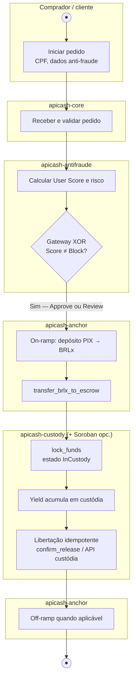

# APICash — arquitetura (versão final do workspace)

Documento alinhado ao código em **`apicash/`** (workspace v0.1, Rust 1.85+): fluxo com **User Score**, **Anchor/mock**, **custódia** e **Soroban** opcional.

## Visão geral

**APICash** é uma plataforma fintech em **Rust** para operações com **custódia (escrow)**, **yield**, integração **Stellar/Anchor** (on-ramp simulado), **anti-fraude** com score de utilizador, **disputas**, **eventos** (Apache Pulsar), **notificações**, canal **WhatsApp**, **autenticação JWT**, API **admin** e **dashboard** web (Leptos). O código está organizado num **Cargo workspace** com **13 crates** reutilizáveis e binários de serviço.

## BPM — caminho feliz (transação protegida)

Diagrama em notação **BPMN** (processo de negócio): apenas o **caminho feliz** — sem bloqueio por score, sem falhas de integração e sem disputa. Piscinas indicam o **sistema** responsável pela tarefa ou gateway.



**Legenda BPMN:** **●** = evento de início/fim; retângulo = tarefa; **losango** = gateway exclusivo (XOR). O ramo **Sim** em `Score ≠ Block?` é o caminho feliz (decisão **Block** não aparece neste diagrama).

## Diagrama textual da arquitetura

```
                    ┌─────────────────────────────────────────────────────────┐
                    │                     Clientes / Ops                       │
                    │  (WhatsApp, HTTP público, dashboard admin, CLI)          │
                    └───────────────┬─────────────────────┬───────────────────┘
                                    │                     │
              ┌─────────────────────▼──────┐    ┌──────────▼────────────┐
              │   apicash-whatsapp       │    │  apicash-frontend     │
              │   (webhook + agente)     │    │  (Leptos SSR + UI)    │
              └─────────────┬────────────┘    └──────────┬────────────┘
                            │                             │
              ┌─────────────▼─────────────┐    ┌──────────▼────────────┐
              │      apicash-core         │    │ apicash-admin-backend │
              │   API pública (Axum)      │    │  API interna (Axum)   │
              │   pedidos, PIX, custódia  │    │  dashboard, disputas  │
              └─────────────┬─────────────┘    └──────────┬────────────┘
                            │                             │
         ┌──────────────────┼─────────────────────────────┼──────────────────┐
         │                  │                             │                  │
         ▼                  ▼                             ▼                  ▼
 ┌───────────────┐ ┌───────────────┐            ┌─────────────┐   ┌─────────────┐
 │ apicash-auth  │ │apicash-antifraude│          │apicash-events│   │apicash-disputes│
 │ JWT, claims   │ │ score, SEFAZ     │          │ Pulsar pub/sub│   │ disputas + custody│
 └───────┬───────┘ └────────┬────────┘            └──────┬──────┘   └────────┬────────┘
         │                  │                            │                  │
         └──────────────────┼────────────────────────────┼──────────────────┘
                            ▼                            ▼
                   ┌─────────────────┐          ┌───────────────────┐
                   │ apicash-custody │◄─────────│  apicash-anchor   │
                   │ lock, yield     │          │  Stellar / PIX    │
                   └────────┬────────┘          └───────────────────┘
                            │
                   ┌────────▼────────┐
                   │ apicash-shared  │
                   │ Money, Order,   │
                   │ config, erros   │
                   └─────────────────┘

Infraestrutura externa (ver `money/docker-compose.yml` + `money/runinfra.sh`): **PostgreSQL**, **Redis**, **Apache Pulsar**. Opcional: **pgAdmin**.

Ferramentas: **apicash-cli** (`test-flow`, `check-custody`, etc.).
```

## Lista de crates (13) e responsabilidades

| # | Crate | Responsabilidade |
|---|--------|------------------|
| 1 | **apicash-shared** | Tipos de domínio (`Money`, `Order`, …), configurações, erros, constantes; módulo `prelude`. |
| 2 | **apicash-custody** | Custódia de fundos, yield, libertação. |
| 3 | **apicash-anchor** | Integração Stellar / anchor (on-ramp PIX simulado). |
| 4 | **apicash-antifraude** | Score, validações SEFAZ/social, decisão de on-ramp. |
| 5 | **apicash-disputes** | Disputas e ligação à custódia. |
| 6 | **apicash-events** | Eventos e consumidores Pulsar. |
| 7 | **apicash-notifications** | Canais de notificação (e-mail, SMS, etc.). |
| 8 | **apicash-whatsapp** | Agente WhatsApp (Cloud API / webhook). |
| 9 | **apicash-auth** | JWT, claims, `AuthService`, middleware Axum (gateway + admin). |
| 10 | **apicash-core** | API HTTP pública: pedidos, PIX, libertação; `POST /auth/login`. |
| 11 | **apicash-admin-backend** | API interna administrativa (dashboard, relatórios, disputas). |
| 12 | **apicash-frontend** | Dashboard administrativo Leptos (SSR + hydrate). |
| 13 | **apicash-cli** | CLI de desenvolvimento e testes manuais. |

## Fluxo principal de uma transação protegida (User Score + Stellar)

Este é o fluxo **funcional** atual para compra **informal P2P** (sem catálogo): o comprador combina com o vendedor fora da plataforma, cria um pedido com valor/descrição e o dinheiro fica em escrow.

1. **Criação do pedido informal** — O comprador inicia um pedido (`apicash-core` ou `apicash-whatsapp`) com **valor** e **descrição** do item, além de dados para anti-fraude.
2. **Validação de score** — `apicash-antifraude` calcula o **User Score** (0–1000) e decide (`Approve` / `Review` / `Block`). Se **Block**, o pedido não segue para custódia.
3. **On-ramp** — `apicash-anchor` inicia funding via **Anchor HTTP** (`APICASH_STELLAR_ANCHOR_URL`) e o pedido fica `PendingFunding`.
4. **Liquidação comprovada** — apenas após prova de settlement (`poll/webhook`) o core avança.
5. **Transferência para Soroban** — `transfer_brlx_to_escrow` move BRLx para o endereço do contrato Soroban de escrow.
6. **Lock on-chain** — `apicash-custody` invoca `lock` no contrato (modo **Soroban** ou **mock** conforme env) e pedido passa a `InCustody`.
7. **Confirmação de recebimento (regra crítica)** — **somente o comprador** pode confirmar o recebimento e autorizar liberação (JWT `sub` amarrado a `buyer_id`).
8. **Liberação segura** — `apicash-custody` executa `confirm_delivery` + `release` (ou compat `confirm_release`), distribui yield 70/10/20 e marca `Released`.
9. **Off-ramp** — após liberação, `apicash-anchor` executa off-ramp (mock por padrão).
10. **Eventos** — eventos podem ser publicados/consumidos via **Pulsar** (`apicash-events`) para integrações assíncronas.

Autenticação: rotas protegidas do core usam **JWT** ou modo legado por API key; admin usa **API key** ou JWT com papel administrativo (ver `apicash-auth`).

## Operação e produção (health, auth, observabilidade)

- **Health checks:** `GET /health` e `GET /ready` em **`apicash-core`**, **`apicash-admin-backend`** e no servidor HTTP do **`apicash-whatsapp`** (webhook), para *liveness/readiness* atrás de load balancers.
- **JWT:** emissão de **access** e **refresh** (`token_use` nas claims); `POST /auth/refresh` renova o par. O middleware da API rejeita **refresh tokens** usados como Bearer nas rotas protegidas.
- **Rate limiting:** `POST /auth/login` e `POST /auth/refresh` passam por **`tower_governor`** (quota configurável na camada Axum).
- **Logs estruturados:** defina `APICASH_LOG_FORMAT=json` para saída JSON nos binários que chamam `apicash_shared::logging::init_tracing` (útil para agregadores em produção).

## Features Cargo: `apicash-custody` e `apicash-anchor`

| Crate | Feature | Comportamento |
|-------|---------|----------------|
| `apicash-custody` | *(sem `soroban`)* | Apenas [`MockSorobanBridge`](../../crates/apicash-custody/src/soroban_bridge.rs); feature `mock` documenta este modo. |
| `apicash-custody` | `soroban` | Compila [`LiveSorobanBridge`](../../crates/apicash-custody/src/soroban_bridge.rs); ativar rede com `APICASH_SOROBAN_ENABLED=1` e env. |
| `apicash-anchor` | `mock` | On/off-ramp **sem** HTTP real (usado pelo `apicash-core` em desenvolvimento). |
| `apicash-anchor` | `soroban` | Inclui `soroban-sdk` opcional; `soroban-prep` é **alias** de `soroban`. |

## Soroban Smart Contracts

O workspace inclui o crate **`soroban-contracts`** (Wasm) com o contrato **`EscrowContract`**:

| Função | Papel |
|--------|--------|
| `initialize` / `init` | Define `admin` e endereço da **plataforma** (20% do yield). |
| `lock` / `lock_funds` | Regista escrow `order_id` (u64), comprador, vendedor e montante; no fluxo atual, o BRLx é transferido para o endereço do contrato **antes** do lock. |
| `confirm_delivery` | Comprador confirma entrega (passo explícito). |
| `release` | Libera principal ao vendedor e reparte o **pool de yield** 70/10/20 (vendedor / comprador / plataforma). |
| `confirm_release` | Compatibilidade: confirma + libera em um passo (fluxo legado). |
| `open_dispute` | Buyer/seller abre disputa (fundos mantidos). |
| `resolve_dispute` | Admin resolve disputa (refund buyer ou release seller). |
| `mark_disputed` | Compatibilidade/admin: marca disputa (fundos mantidos). |

**Integração com `apicash-custody`**

- O serviço [`CustodyService`](../../crates/apicash-custody/src/service/custody_service.rs) usa um [`SorobanCustodyBridge`](../../crates/apicash-custody/src/soroban_bridge.rs): por defeito **mock** (hashes simulados).
- Com a feature Cargo **`soroban`** em `apicash-custody` e `APICASH_SOROBAN_ENABLED=1`, o bridge **live** tenta invocar o contrato via CLI **`stellar`** (`lock`, `confirm_delivery`, `release`, `deploy`), com *fallback* mock se faltar RPC/segredo ou o comando falhar.
- Variáveis: `APICASH_SOROBAN_RPC_URL`, `APICASH_SOROBAN_ESCROW_CONTRACT_ID`, `APICASH_SOROBAN_SOURCE_SECRET`, `APICASH_BRLX_TOKEN_CONTRACT_ID`, endereços Stellar `APICASH_STELLAR_BUYER_ADDRESS` / `APICASH_STELLAR_SELLER_ADDRESS`.

**`apicash-core` / `apicash-anchor`**

- **`POST /orders`**: após score aprovado, inicia funding e devolve `pix_br_code`, `funding_instruction` e referências do anchor mantendo `PendingFunding`.
- **`POST /orders/{id}/settle`** ou **`POST /internal/orders/settle`**: valida settlement no rail e então executa `transfer_brlx_to_escrow` + `lock_funds`.
- Invariante: **PIX de entrada vai para a conta institucional do emissor/anchor**, nunca para o vendedor diretamente.

**Eventos (`apicash-events`)**

- `FundsLockedOnChain`, `YieldDistributedOnChain`, `FundsReleasedOnChain` — payloads para Pulsar quando integrar publicação a partir do core ou workers.

## Variáveis de ambiente

Ver [`money/.env.example`](../../.env.example) (modelo único no monorepo) e o [README](../README.md).
