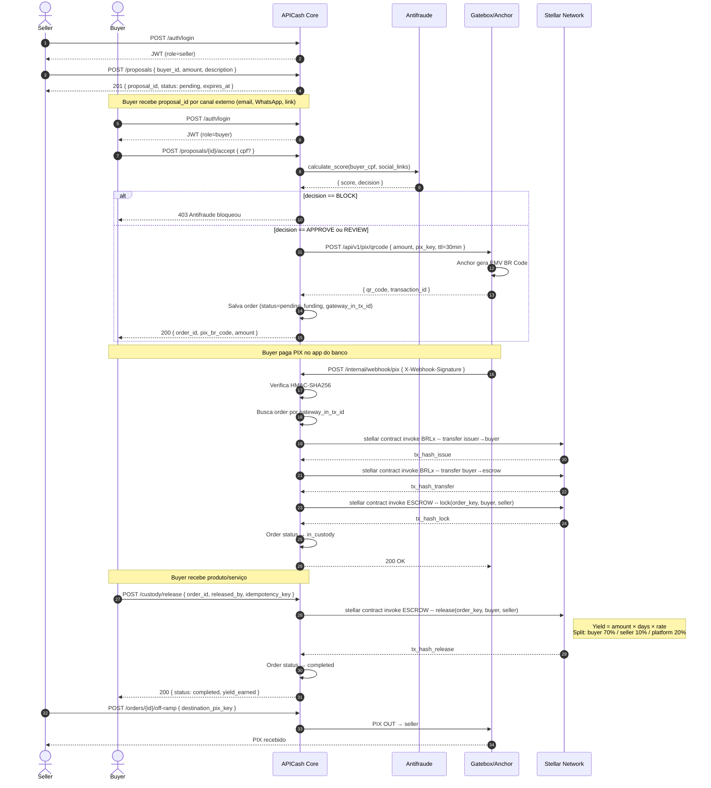

# APICash — BPM Flows

Diagramas de processo para todos os fluxos do sistema APICash.

---

## Fluxo 1: REST API — Proposta → Escrow → Liberação

---

## Fluxo 2: WhatsApp — Máquina de Estados Conversacional

```mermaid
flowchart LR
    %% Estados do Seller
    SI([Seller: Idle])
    SA["Seller: AskAmount\n(digita valor)"]
    SP["Seller: AskPhone\n(digita telefone buyer)"]
    SW["Seller: WaitingBuyerAccept\n(proposta enviada)"]

    %% Estados do Buyer
    BI([Buyer: Idle])
    BP["Buyer: PendingSellerProposal\n(proposta recebida)"]
    BA["Buyer: AwaitingPayment\n(PIX copia-e-cola enviado)"]
    BC["Buyer: AwaitingConfirmation\n(pedido in_custody)"]

    %% Seller flow
    SI -->|"menciona vender\nou /nova"| SA
    SA -->|"envia valor\n(ex: R$100)"| SP
    SP -->|"envia telefone\n+55..."| SW

    SW -->|"buyer aceita"| SI
    SW -->|"buyer rejeita"| SI
    SW -->|"timeout 60min"| SI

    %% Buyer flow
    BI -->|"recebe proposta\ndo seller"| BP

    BP -->|"responde SIM /\naceitar"| BA
    BP -->|"responde NAO /\nrejeitar"| BI

    BA -->|"webhook PIX\nconfirmado"| BC
    BA -->|"timeout sem\npagamento"| BI

    BC -->|"confirma entrega\n/recebido"| BI
    BC -->|"abre disputa\n/disputa [motivo]"| DH

    DH["DisputeHint\n(equipe notificada)"] --> BI

    %% Antifraude gateway
    AP{{"Antifraude\ngateway"}}
    SW -->|"proposta aceita"| AP
    AP -->|"APPROVE / REVIEW"| BA
    AP -->|"BLOCK"| BI2([Buyer: Idle\nbloqueado])

    %% Estilos
    style SI fill:#2d6a4f,color:#fff
    style BI fill:#1d3557,color:#fff
    style BI2 fill:#c1121f,color:#fff
    style AP fill:#e9c46a,color:#000
    style DH fill:#e76f51,color:#fff
```

---

## Fluxo 3: PIX — Geração de QR e Confirmação via Webhook

```mermaid
sequenceDiagram
    autonumber
    participant Core as APICash Core
    participant Gate as Gatebox
    participant Anchor as Anchor (PSP)
    actor Buyer as Buyer (banco)

    rect rgb(30, 60, 90)
        Note over Core,Anchor: Subfluxo A — Geração do QR Code PIX
        Core->>Gate: POST /api/v1/pix/qrcode<br/>{ amount, memo, pix_key, ttl_seconds: 1800 }
        Gate->>Anchor: Solicita EMV BR Code
        Anchor-->>Gate: BR Code gerado
        Gate-->>Core: { qr_code, transaction_id }
        Core->>Core: Salva gateway_in_tx_id e pix_br_code no pedido
        Core-->>Core: status = pending_funding
    end

    Note over Buyer,Anchor: Buyer abre app do banco e paga o PIX

    rect rgb(30, 80, 60)
        Note over Core,Anchor: Subfluxo B — Confirmação via Webhook
        Buyer->>Anchor: Realiza pagamento PIX
        Anchor->>Gate: Notificação de pagamento confirmado
        Gate->>Gate: Valida transação (tipo, status)
        Gate->>Core: POST /internal/webhook/pix<br/>{ event_type, transaction_id, amount, status }<br/>X-Webhook-Signature: <hex HMAC-SHA256>

        Core->>Core: Verifica X-Webhook-Signature
        alt Signature inválida
            Core-->>Gate: 401 Unauthorized
        else Signature válida
            Core->>Core: Filtra event_type
            alt pix_out / reversal / test
                Core-->>Gate: 200 OK (ignorado)
            else status = completed/paid/success/done/confirmed
                Core->>Core: Busca order por gateway_in_tx_id
                alt Order encontrada
                    Core->>Core: settle_order_by_id()
                    Note right of Core: → emite BRLx → lock escrow<br/>→ order: in_custody
                    Core-->>Gate: 200 OK { settled: true }
                else Order não encontrada
                    Core-->>Gate: 200 OK { settled: false }
                end
            end
        end
    end

    Note over Core: Poller (APICASH_FUNDING_POLLER) continua como fallback
```

---

## Fluxo 4: Soroban/Stellar — Operações On-Chain

```mermaid
sequenceDiagram
    autonumber
    participant Anchor as APICash Anchor
    participant Custody as APICash Custody
    participant CLI as stellar CLI
    participant RPC as Stellar Network<br/>(Soroban RPC)

    rect rgb(50, 30, 80)
        Note over Anchor,RPC: Subfluxo A — Emissão BRLx + Transferência ao Escrow

        Anchor->>Anchor: Verifica APICASH_STELLAR_ISSUER_SECRET

        alt mainnet sem ISSUER_SECRET
            Anchor-->>Anchor: Erro crítico (aborta)
        else testnet sem ISSUER_SECRET
            Anchor-->>Anchor: Skip (contas pré-fundadas pelo bootstrap)
        else ISSUER_SECRET presente
            Anchor->>CLI: contract invoke BRLx SAC<br/>-- transfer --from ISSUER --to BUYER --amount STROOPS
            CLI->>RPC: Submete transação assinada
            RPC-->>CLI: tx_hash_issue
            CLI-->>Anchor: tx_hash_issue

            Anchor->>CLI: contract invoke BRLx SAC<br/>-- transfer --from BUYER --to ESCROW --amount STROOPS
            CLI->>RPC: Submete transação assinada
            RPC-->>CLI: tx_hash_transfer
            CLI-->>Anchor: tx_hash_transfer
        end
    end

    rect rgb(30, 50, 80)
        Note over Anchor,RPC: Subfluxo B — Lock no Contrato Escrow

        Anchor->>Custody: lock_funds(order_id, buyer, seller, amount)
        Custody->>Custody: Gera order_key (u64 hash do UUID)
        Custody->>CLI: contract invoke ESCROW<br/>-- lock(order_key, buyer_addr, seller_addr, token, amount)
        CLI->>RPC: Submete transação assinada
        RPC-->>CLI: soroban_lock_tx_hash
        CLI-->>Custody: soroban_lock_tx_hash
        Custody->>Custody: Cria Custody { status=Locked, ttl=7d }
        Custody-->>Anchor: { custody_id, soroban_lock_tx_hash }
    end

    rect rgb(30, 80, 50)
        Note over Anchor,RPC: Subfluxo C — Release + Distribuição de Yield

        Anchor->>Custody: release_funds(order_id, released_by)
        Custody->>Custody: Calcula yield<br/>amount × days_locked / 1_000_000
        Note right of Custody: Split:<br/>• buyer  → 70%<br/>• seller → 10%<br/>• platform → 20%
        Custody->>CLI: contract invoke ESCROW<br/>-- release(order_key, buyer_addr, seller_addr)
        CLI->>RPC: Submete transação assinada
        RPC-->>CLI: soroban_release_tx_hash
        CLI-->>Custody: soroban_release_tx_hash
        Custody->>Custody: Atualiza Custody { status=Released, actual_release_at, yield_earned }
        Custody-->>Anchor: { released: true, soroban_release_tx_hash, yield_earned }
    end
```

